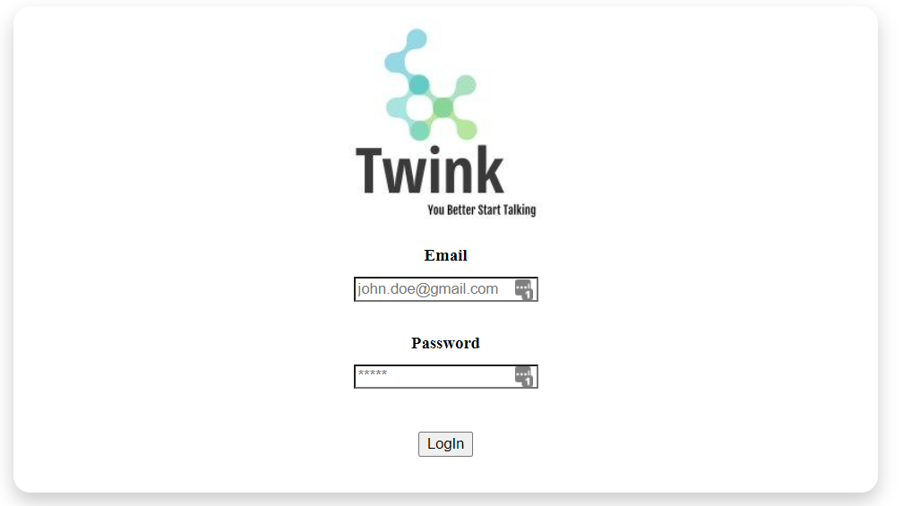
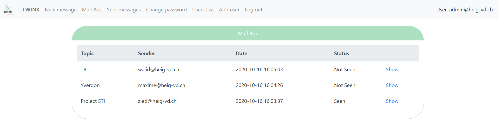
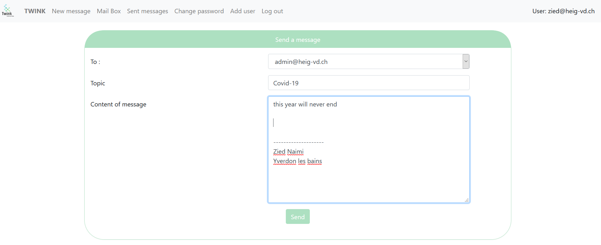
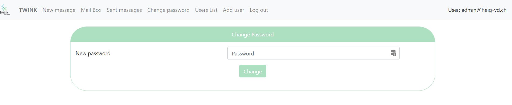
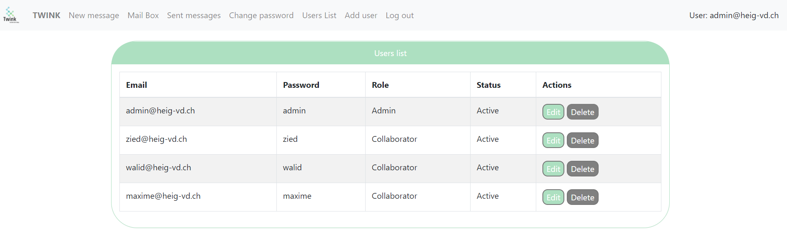
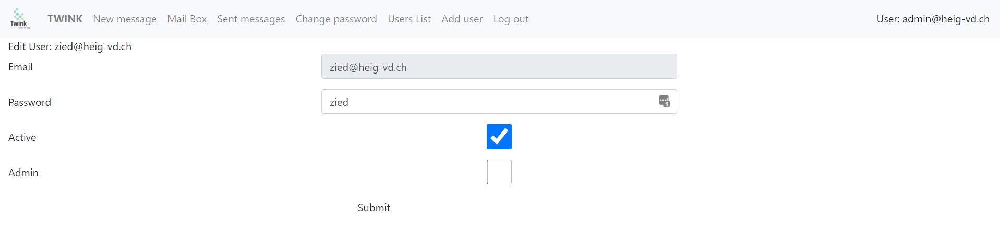
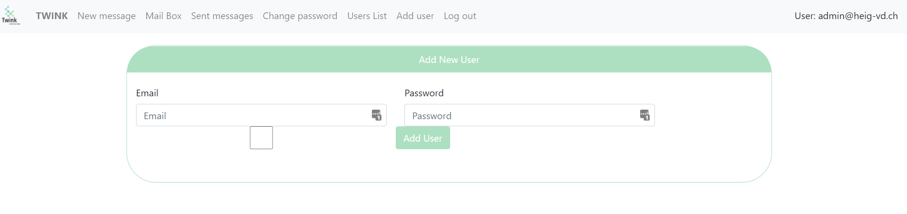

                                                                                                         
<p align="center">
  
</p> 

### Table of contenant 
- [Introduction](#introduction)
- [Main features](#main-features)
- [Main structure](#main-structure)
- [Quick start](#quick-start)
- [How to use](#how-to-use)
    + [Authentication](#authentication)
    + [The Inbox](#the-inbox)
    + [The Outbox](#the-outbox)
    + [Write a message](#write-a-message)
    + [Modify password](#modify-password)
    + [Try it like an Administrator](#try-it-like-an-administrator)
      - [Consult all users](#consult-all-users)
      - [Modify or delete a user](#modify-or-delete-a-user)
      - [Add a new user](#add-a-new-user)
### Introduction 

 This project is developed within the scope of the course Internet Technology Security, as a part of the main project of Security and vulnerability.
It, therefore, consists to develop a very simple web application that allows users, as part of a business, to send text messages between collaborators.

  ### Main features
  The application offers many features for each type of user. As said previously, we can use the messaging application as a collaborator or as an administrator.
  By using it as an administrator you can :
  *    Add, delete or modify  a user
  *    Send and Read message as like reply for them .you can also delete a message. (2)
  *    Modify his password (3)
  *    Consult the main directory of all users
      
  On the other hand, If you use the application as a collaborator, you will get the same features as the administrator in the point (2) and (3) . 
  
### Main structure 

The following scheme provides a brief description of each used files in the project :  

```bash
          File                   |           Use
---------------------------------|---------------------------------------------
├───databases                ----> Contain the database 
│       database.sqlite
│
└───html
    │   addingUser.php       ---->  adding a user .
    │   addingUserPage.php   ---->  adding a user view (HTML)
    │   deleteUser.php       ---->  delete a user 
    │   doDetails.php        ---->  containnig commands that delete and reply a message 
    │   editPassword.php     ---->  modify the password 
    │   editPasswordPage.php ---->  modify the password view (HTML) 
    │   editUser.php         ---->  modify a user 
    │   editUserPage.php     ---->  modify user view
    │   header.php           ---->  the header of all pages ( used for navigation )
    │   includes.php         ---->  by including this file we keep the current session
    │   index.php            ---->  the home page
    │   listUser.php         ---->  list of all users 
    │   login.php            ---->  the login page 
    │   loginPage.php        ---->  the login page view
    │   logout.php           ---->  containnig the logout commands 
    │   messageDetails.php   ---->  view page of the details of a message 
    │   phpliteadmin.php     ---->
    │   sentBox.php          ---->  the outbox 
    │   confirmation.php     ---->  page indicate the succuess of operation
    │   write.php            ---->  write a message commands 
    │   writeMessagePage.php ---->  write a message view
    │
    ├───assets               ----> all bootstap and css files 
    │   ├───bootstrap
    │   ├───css
    │   └───img
    │
    ├───controller           
    │       Message.php      ----> object contains all function for a user 
    │       User.php         ---->  object contains all function of message
    │
    └───dataManager              
            Db.php           ----> Object take care of database connection and most used function 
```
### Quick start
The main project directory provides two scripts that's take care of starting and stopping the application. Simply it's a set of docker commands that's run a container named "Twink".

*     start.sh:

   ```bash
   # pull and run a container named "Twink"
   docker run -ti -v "$PWD/site":/usr/share/nginx/ -d -p 8080:80 --name Twink --hostname sti arubinst/sti:project2018

   # run the web and PHP servers 
   docker exec -u root Twink service nginx start
   docker exec -u root Twink service php5-fpm start
   ```   
   
*     stop.sh:

   ```bash
   #stop the conatainer
   docker stop Twink
   #remove the image
   docker rmi -f arubinst/sti:project2018
   ```

### How to use 
 The following table contains a list of pre-populated users in the database hoping to facilitate the first use and the test stage of the application.
 
| username         | password      | admin |
| -----------------|:-------------:| -----:|
| admin@heig-vd.ch | admin         | yes   |
| zied@heig-vd.ch  | zied          | no    |
| walid@heig-vd.ch | walid         | no    |
|maxime@heig-vd.ch | maxime        | no    |

##### Authentication
 The Login page allows a user to gain access to the application. The user will authenticate on this page, typically by entering a username and password.
 here is a screenshot of the graphical interface of this page :
 

##### The Inbox
This page is simply an overview of all received messages by the current user. Each line contains some flags that give the user some pieces of information about the message (date, the sender, seen or not ). We simply can explore the message by clicking on details. This last action allows the user to consult the message and also to reply it.
 

##### The Outbox
This is the twin page of the previous one because it simply shows all sent messages :


##### Write a message
Here one of the most important pages.it allows the user to send a message and select the destination (in our case we can choose only one destination ):


##### Modify password
One of the bases features for any application is to allow a user to change his password, the following page gives as this ability:


##### Try it like an Administrator 
The administrator has some privilege he can consult the list of all users, also he can modify or delete a  user and even adding a new one, the following sections give as 
an idea of how a sample administrator performs those features:
###### Consult all users 


###### Modify or delete a user


###### Add a new user

